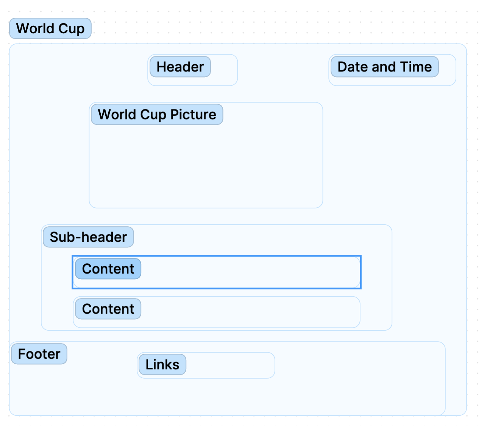
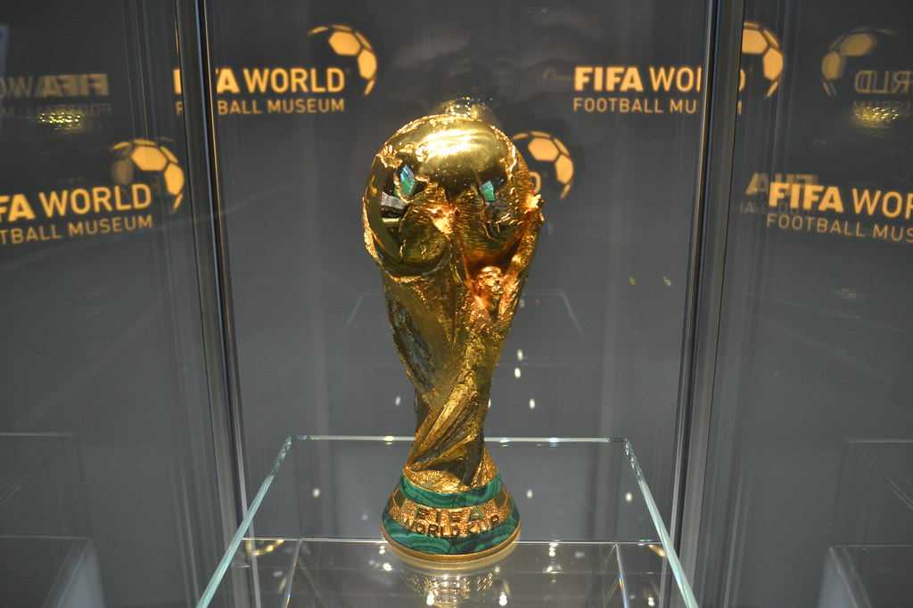
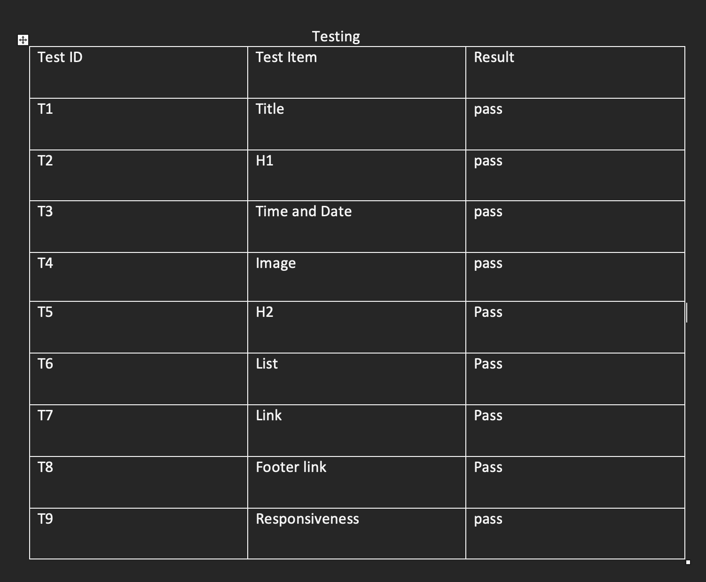

# Purpose of the project
Your first project is to create a Hobby Page. This can be about one of your hobbies, a particular interest of yours, or a public figure you admire. You are not required to make this about yourself or disclose anything personal. The page will be built with HTML, styled with CSS and use a bit of JavaScript.

# Requirements
<li>The page has a title which informs the user what the site is about.</li>
<li>The page has a logical layout and clear structure.</li>
<li>There are images on the page, with alt-text where appropriate.</li>
<li>The page is visually interesting, for example with borders or colours.</li>
<li>A list is visible somewhere on the page.</li>
<li>Everything on the page fits on any screen size, without content overflowing or being cut off.</li>
<li>A user can click on a link that takes them to another website.</li>
<li>The page has a header element, and a footer element.</li>
<li>Somewhere on the page, the user can see today’s date. </li>
<li>The date should always be correct. </li>
<li>You’ll need to use JavaScript to generate the date, and DOM manipulation to display it.</li>
 

# World Cup
In this project, I will share my interest for the FIFA World Cup 2022, 
which will start the 20th of November in Qatar.
The World Cup is held once every four years, it is my favourite sports tournament.
 

# Design

Sketch design 

 

 

# fonts
I have used Oswald fonts for the h1 and h2; from Google.
I have used Playfair Display fonts for the paragraph; from Google.
  

 # credit 
 
 ## image 
 

World Cup

 

I have downloaded <a href="https://live.staticflickr.com/1965/44451488875_dd80f8ff9d_b.jpg">here</a>

# Testing

details>

Manual testing

 

